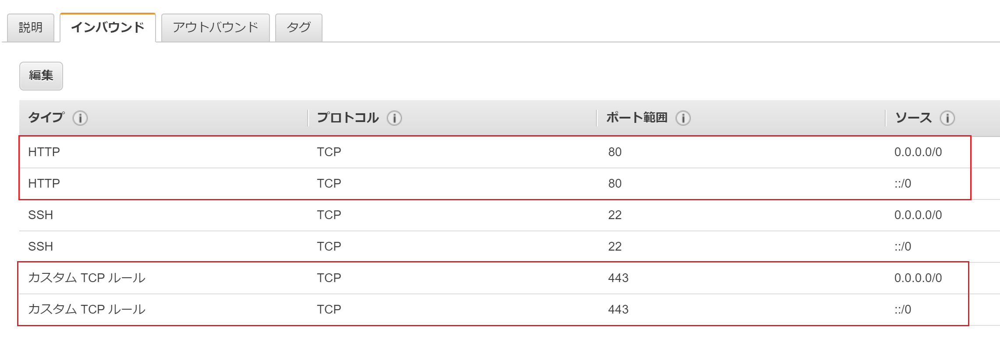

## Let's Encrypt とは

無料で SSL/TLS 証明書を発行してくれる CA(認証局)。  
証明書の発行・更新は専用のクライアント「certbot」が提供されていて、運用が楽。

### 無料である理由

- 非営利団体の[ISRG(Internet Security Research Group)](https://letsencrypt.org/isrg/)が提供
- Mozilla、CiscoSystems、FaceBook などの大手企業が[スポンサー](https://letsencrypt.org/sponsors/)についている

### 参考サイト

[公式ページ](https://letsencrypt.org/)  
[日本語ポータルサイト](https://letsencrypt.jp/)  
[サクラのナレッジ](https://knowledge.sakura.ad.jp/5573/)

## SSL/TLS 証明書の種類

証明書は大きく 3 種類存在する。

- ドメイン認証(DV - DomainValidation)
  - ドメインを保有していることを証明する
  - 発行が早い。安い。
- 企業認証(OV - OrganizationValidation)
  - 存在している企業・団体であることを証明する
  - 書類審査、電話確認などがあり多少時間がかかる
- EV 認証(EV - ExtendedValidation)
  - 企業認証から基準を更に厳格にしたもの
  - 書類審査、電話確認、第三者機関による確認、在籍確認など
  - 信頼性は一番高い
  - アドレスバーに組織名が表示される

Let's Encrypt はドメイン認証のみ提供。

個人で使用したり、通信の暗号化や SEO が目的の場合はドメイン認証で構わない。  
EC サイトなど決済情報を扱う場合は、企業認証・EV 認証が良い。

## 対象環境

- AWS EC2
- OS: Ubuntu 16.04.4 LTS

## バージョン

- certbot: 0.26.1
- Apache2: 2.4.18

## インストール手順

1. apt のリポジトリに certbot の公式 PPA リポジトリを追加する

```bash
sudo add-apt-repository ppa:certbot/certbot
```

※ add-apt-repository コマンドが無い場合、
　 先に software-properties-common を入れておく

```bash
sudo apt install software-properties-common
```

2. certbot をインストール

apacheHTTP サーバーに導入する場合は、プラグイン等も  
 同時にインストールできる以下のパッケージを入れる

```bash
sudo apt install python-certbot-apache
```

3. AWS のコンソール画面でポートに穴を開ける
   cert-bot が証明書する際に 80 番(http)、443 番(https)を使用するため  
    AWS を使用している場合は、セキュリティグループの設定で開けておく  
   

4. 証明書取得

   証明書取得時に certbot が 80,443 ポートを使用するため、  
   apacheHTTP サーバーが起動している場合、ポートが被ってしまう。

   そこで証明書取得時に使用するモジュールを、起動している HTTP サーバー  
   のドキュメントルート配下に、一時的に置き、証明書取得を行うため、  
   port のバッティングを回避できる。

```bash
certbot certonly --apache --webroot -w /var/www/html -d ドメイン名 --email 連絡用メールアドレス
```

5. ApacheHTTP サーバーの SSL 設定

ApacheHTTP サーバーが取得した証明書を見るように設定する

/etc/apache2/sites-available/default-ssl.conf

```text
SSLCertificateFile      /etc/letsencrypt/live/ドメイン名/cert.pem
SSLCertificateKeyFile   /etc/letsencrypt/live/ドメイン名/privkey.pem
SSLCertificateChainFile /etc/letsencrypt/live/ドメイン名/chain.pem
```

※ /etc/letsencrypt/live/ 配下の証明書を設定すること  
 /etc/letsencrypt/live/ 配下はシンボリックリンクになっていて、  
 常に最新の証明書を向いている。  
 証明書を更新して、新しい証明書になった場合も証明書を使う側の設定を変える必要がない。

## 証明書更新設定

Let's Encrypt で取得した証明書は有効期限が取得日から 90 日と短い。  
cron で毎月 1 日に証明書の更新を試みるように設定しておく。

```bash
certbot renew --webroot -w /var/www/html
```

ApacheHTTP サーバーは常時起動しているため、ここでもポートが被らないよう  
ドキュメントルート配下を一時的に借りて更新作業を行うように設定しておく。

※ --dry-run オプションを付けて実行すると、コマンドが正常に動作するか確認することができる。  
　 実際に証明書取得や更新は行わない。
